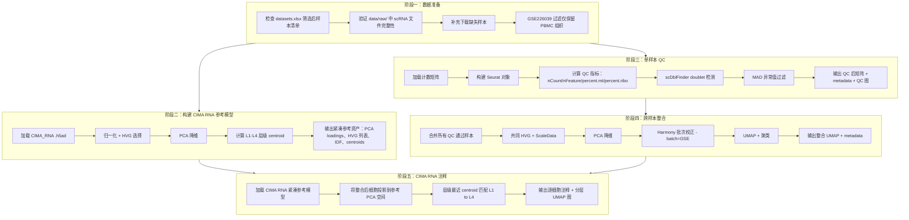

# scRNA 单细胞质控、整合、注释流程计划

## 1. 背景与目标

基于 `datasets.xlsx` 中 `pbmc_samples` sheet 筛选后的样本，对 scRNA 数据完成：

1. **单样本质控 (QC)**：逐样本过滤低质量细胞和 doublet
2. **跨样本整合**：将所有 QC 通过的样本合并，消除批次效应
3. **细胞类型注释**：利用 CIMA RNA 参考图谱进行层级注释

---

## 2. 数据现状分析

### 2.1 已确认可用的 scRNA 数据集

| GSE | 样本数 | 数据格式 | 本地状态 |
|-----|--------|---------|---------|
| GSE149689 | 4 | GSE 级共享 mtx | ✅ 已下载 |
| GSE167363 | 2 | per-GSM mtx | ✅ 已下载 |
| GSE192391 | 6 | per-GSM mtx | ✅ 已下载 |
| GSE198533 | 10 | GSE 级共享 gene_count_csv | ✅ 已下载 |
| GSE198891 | 3 | per-GSM mtx | ✅ 已下载 |
| GSE157007 | 12 | per-GSM mtx/tsv 混合 | ✅ 已下载 |
| GSE213516 | 17 | per-GSM mtx | ✅ 已下载 |
| GSE226039 | 21 | per-GSM mtx，每个 GSM 有 PBMC/Ileum/Rectum | ✅ 已下载，需过滤仅保留 PBMC |
| GSE231794 | 3 | per-GSM tar.gz 归档 | ✅ 已下载 |
| GSE268936 | 3 | per-GSM mtx | ✅ 已下载 |
| GSE214546 | ~54 | labeled.h5 / filtered_feature_bc_matrix.h5 | ⚠️ TEA-seq 子集有 .h5，纯 RNA 子集需确认 |
| GSE190992 | 24 | labeled.h5 | ❌ 仅有 ATAC fragment 和 .rda.gz，scRNA .h5 未下载 |
| GSE161354 | 2 | tar.gz | ❌ 目录不存在 |
| GSE220189 | 23 | RData.gz | ❌ 目录不存在 |

### 2.2 CIMA RNA 参考资产

已就位于 `data/reference/cima/`：
- `CIMA_RNA_6484974cells_36326genes_compressed.h5ad` — CIMA scRNA 参考图谱
- `CIMA_Cell_Type_L4_COSG_Marker_Results.csv` — L4 层级 marker 基因
- `CIMA_Cell_Type_Level_and_Marker.xlsx` — 层级与 marker 定义
- 已有 ATAC 侧的紧凑参考模型资产（可参照其架构构建 RNA 侧）

### 2.3 已有脚本能力

- `process_single_rna_sample.R` — 已支持多种矩阵格式、MAD QC、scDblFinder、PCA/UMAP、marker-based 注释、可选 reference transfer
- `pipeline.py` — 已有 ATAC 和 RNA 样本发现/调度框架
- `build_cima_reference_model.py` — 已有 ATAC 参考模型构建逻辑，可参照构建 RNA 版

---

## 3. 整体流程架构



---

## 4. 详细实施步骤

### 阶段一：数据完整性确认与补全

**目标**：确保所有 xlsx 筛选后的 scRNA 样本在本地有可用的计数矩阵文件。

**具体任务**：
1. 编写数据完整性检查脚本，对比 xlsx 中 `测序数据=scRNA` 的行与 `data/raw/` 中实际文件
2. 对缺失数据集执行下载（GSE161354、GSE220189、GSE190992 的 scRNA .h5 文件）
3. GSE226039 特殊处理：每个 GSM 有 Ileum/PBMC/Rectum 三种组织，仅保留 `_PBMC_` 文件
4. GSE231794 的 tar.gz 归档需要解压后检测内部结构
5. GSE198533 的共享 CSV 格式已在 `process_single_rna_sample.R` 中支持
6. 确认 GSE214546 的 scRNA-only 子集（GSM6611359、GSM6929079-121、GSM7498081-96）的 .h5 文件是否已下载

**输出**：`data/raw/` 中所有 scRNA 样本可用的计数矩阵文件

### 阶段二：构建 CIMA RNA 紧凑参考模型

**目标**：从 `CIMA_RNA_6484974cells_36326genes_compressed.h5ad` 构建类似 ATAC 侧的紧凑参考模型。

**具体任务**：
1. 编写 `build_cima_rna_reference_model.py`
   - 加载 CIMA RNA .h5ad，提取 `obs` 中的 `cell_type_l1` ~ `cell_type_l4`
   - 按层级标签做分层抽样（控制总细胞数，如 50 万），平衡各层级
   - 对抽样细胞做：归一化 → HVG 选择（如 3000 基因）→ PCA（如 50 维）
   - 保存：HVG 列表、PCA loadings、均值/标准差（用于 query 投影）
   - 在 PCA 空间计算 L1-L4 各层级 centroid
   - 输出参照 ATAC 侧命名：`cima_rna_reference_pca_features.tsv.gz`、`cima_rna_reference_l1_centroids.tsv` 等
2. 同时从 `CIMA_Cell_Type_L4_COSG_Marker_Results.csv` 提取 marker 信息，供 marker-based 备选注释使用
3. 构建 `cima_rna_reference_model.json` 记录参数

**输出文件**（`data/reference/cima/`）：
- `cima_rna_reference_pca_features.tsv.gz` — HVG + PCA loadings + 缩放参数
- `cima_rna_reference_l1_centroids.tsv` ~ `cima_rna_reference_l4_centroids.tsv`
- `cima_rna_reference_model.json`
- `cima_rna_celltype_hierarchy.csv`（可能需要从 RNA .h5ad 重新提取）

### 阶段三：更新单样本 scRNA QC 脚本

**目标**：`process_single_rna_sample.R` 已具备核心能力，需确认其在所有数据格式上工作正常。

**具体任务**：
1. 审查现有 `process_single_rna_sample.R` 对以下格式的处理：
   - GSE 级共享矩阵（GSE149689、GSE198533）
   - tar.gz 归档（GSE231794）
   - 10x .h5 文件（GSE214546、GSE190992）— **需要新增 .h5 加载支持**
   - 混合 tsv/mtx（GSE157007）
2. 新增 10x .h5 文件加载逻辑（使用 `Seurat::Read10X_h5` 或 `H5ADFile`）
3. 确认 GSE226039 的 PBMC-only 过滤逻辑（可在文件发现阶段只匹配 `*_PBMC_*` 文件）
4. 单样本 QC 输出规范确认：
   - `qc_overview.png`
   - `metadata.csv` / `metadata_qc.csv`
   - `qc_summary.csv`
   - `matrix/matrix.mtx` + `barcodes.tsv.gz` + `features.tsv.gz`
   - `{GSM}_seurat_qc.rds`

**注意**：单样本阶段不做 CIMA 投影注释，注释在整合后统一进行。

### 阶段四：编写跨样本整合脚本

**目标**：将所有 QC 通过的样本合并，消除批次效应，生成整合 UMAP。

**具体任务**：
1. 编写 `integrate_rna_samples.R`（或 `.py`，根据偏好）
2. 流程：
   - 逐样本读取 `{GSM}_seurat_qc.rds`，提取 pass_qc 细胞
   - `merge()` 合并所有样本，`add.cell.ids = GSM` 标识来源
   - 共同 HVG 选择 → `ScaleData` → `RunPCA`
   - `RunHarmony(group.by = "dataset")` 以 GSE 为 batch 进行校正
   - `RunUMAP(reduction = "harmony")` + `FindNeighbors(reduction = "harmony")` + `FindClusters()`
3. 输出：
   - 整合 Seurat 对象 RDS
   - 整合 metadata CSV（含 UMAP 坐标、cluster、来源信息）
   - UMAP 图（按 GSE、cluster、QC 指标着色）

**备选方案**：如果 Harmony 效果不佳，可尝试 Seurat RPCA 整合。

### 阶段五：编写 CIMA RNA 注释脚本

**目标**：将整合后的细胞投影到 CIMA RNA 参考 PCA 空间，做层级 centroid 匹配注释。

**具体任务**：
1. 编写 `annotate_rna_with_cima.py`（参照 ATAC 侧的注释逻辑）
2. 流程：
   - 加载 CIMA RNA 紧凑参考模型（HVG、PCA loadings、缩放参数）
   - 对 query 细胞：用相同 HVG 子集 → 用参考的均值/标准差缩放 → 用参考 PCA loadings 投影
   - 在投影后的 PCA 空间中，逐层做最近 centroid 匹配：L1 → 在 L1 允许的 L2 子集中匹配 L2 → ... → L4
   - 输出每个细胞的 `cima_cell_type_l1` ~ `cima_cell_type_l4`、匹配距离/得分
3. 可视化：
   - 4 张整合 UMAP 图（按 L1-L4 着色，使用统一配色方案）
   - 参考空间 UMAP（将 query 投影到参考 UMAP 空间）
4. 写回整合 metadata

**备选注释**：
- 可同时运行 marker-based 注释（已有逻辑）作为交叉验证
- 可用 `CIMA_Cell_Type_L4_COSG_Marker_Results.csv` 中的 marker 做辅助注释

### 阶段六：更新 pipeline.py 调度逻辑

**目标**：在 `pipeline.py` 中暴露 RNA 流程的完整调度。

**具体任务**：
1. 新增 `run-rna-sample` 子命令：运行单个 RNA 样本 QC
2. 新增 `run-rna-gse` 子命令：运行整个 GSE 的 RNA 样本
3. 新增 `run-rna-all` 子命令：运行所有 RNA 样本
4. 新增 `integrate-rna` 子命令：触发跨样本整合
5. 新增 `annotate-rna` 子命令：触发 CIMA RNA 注释
6. 新增 `rna-status` 子命令：查看 RNA 样本状态
7. 确保 `discover_rna_samples()` 能正确发现所有格式的 RNA 样本

### 阶段七：端到端测试与验证

**具体任务**：
1. 先用 2-3 个小样本（如 GSE198891 的 3 个样本）做端到端测试
2. 检查 QC 图是否正常
3. 检查整合 UMAP 是否合理（不同 GSE 的同类细胞应混合）
4. 检查 CIMA 注释结果是否与已知 PBMC 细胞类型一致
5. 扩展到全部样本

---

## 5. 文件产出清单

### 新增脚本
| 文件路径 | 用途 |
|---------|------|
| `scripts/process/build_cima_rna_reference_model.py` | 构建 CIMA RNA 紧凑参考模型 |
| `scripts/process/integrate_rna_samples.R` | 跨样本 Harmony 整合 |
| `scripts/process/annotate_rna_with_cima.py` | CIMA RNA 层级注释 |

### 需修改的脚本
| 文件路径 | 修改内容 |
|---------|---------|
| `scripts/process/process_single_rna_sample.R` | 新增 .h5 加载支持 |
| `scripts/process/pipeline.py` | 新增 RNA 调度子命令 |

### 新增参考资产
| 文件路径 | 内容 |
|---------|------|
| `data/reference/cima/cima_rna_reference_pca_features.tsv.gz` | HVG + PCA loadings |
| `data/reference/cima/cima_rna_reference_l1_centroids.tsv` ~ `l4` | 层级 centroids |
| `data/reference/cima/cima_rna_reference_model.json` | 构建参数 |
| `data/reference/cima/cima_rna_celltype_hierarchy.csv` | RNA 侧层级映射 |

### 输出目录结构
```
output/rna/
├── {GSE}/{GSM}/
│   ├── qc_overview.png
│   ├── metadata.csv
│   ├── metadata_qc.csv
│   ├── qc_summary.csv
│   ├── matrix/
│   │   ├── matrix.mtx
│   │   ├── barcodes.tsv.gz
│   │   └── features.tsv.gz
│   └── {GSM}_seurat_qc.rds
├── integration/
│   ├── integrated_seurat.rds
│   ├── integrated_metadata.csv
│   ├── umap_by_gse.png
│   ├── umap_by_cluster.png
│   ├── umap_cima_cell_type_l1.png
│   ├── umap_cima_cell_type_l2.png
│   ├── umap_cima_cell_type_l3.png
│   └── umap_cima_cell_type_l4.png
└── qc_summary/
    ├── rna_qc_summary.csv
    └── rna_qc_overview.png
```

---

## 6. 关键技术决策

| 决策点 | 选择 | 理由 |
|-------|------|------|
| 整合方法 | Harmony | 成熟、快速、适合多样本 PBMC；与 Seurat 生态兼容 |
| 降维方法 | PCA + Harmony | scRNA 标准路线，区别于 ATAC 的 TF-IDF+LSI |
| 注释方法 | CIMA RNA centroid 投影 | 与 ATAC 侧方法一致，可扩展到百万级参考 |
| QC 过滤 | MAD 异常值 + doublet | 与 ATAC 侧一致，避免全局硬阈值 |
| 单样本注释 | 暂不做，整合后统一做 | 避免单样本注释与整合后注释不一致 |
